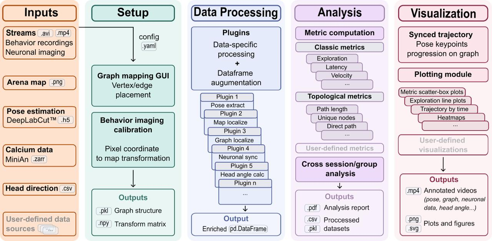

<p align="left">
  
</p>

<style>
@media (prefers-color-scheme: light) {
  img[alt="NaviGraph Logo"] {
    background-color: #e6e6e6 !important;
    padding: 25px !important;
    border-radius: 10px !important;
    border: 2px solid #d0d7de !important;
  }
}

@media (prefers-color-scheme: dark) {
  img[alt="NaviGraph Logo"] {
    background-color: transparent !important;
    padding: 0 !important;
    border: none !important;
  }
}
</style>

A flexible framework for multi-session behavioral experiments that enables researchers to integrate, synchronize, and analyze diverse data sources within unified spatial and temporal domains. NaviGraph provides the freedom to combine any data streams, implement custom metrics, and visualize results across time and graph-based spatial representations - all within a single, coherent analysis environment.

[](https://opensource.org/licenses/MIT)

---

<p align="left">
   
</p>

---

## Table of Contents

- [Overview](#overview)
- [Installation](#installation)
- [Quick Start](#quick-start)
- [CLI Usage](#cli-usage)
- [Configuration](#configuration)
- [Graph Architecture](#graph-architecture)
- [Plugin System](#plugin-system)
- [Spatial Calibration](#spatial-calibration)
- [Analysis Pipeline](#analysis-pipeline)
- [Visualization](#visualization)
- [Examples](#examples)
- [Extending NaviGraph](#extending-navigraph)
- [Contributing](#contributing)
- [Citation](#citation)
- [License](#license)

## Overview

NaviGraph solves a critical challenge in behavioral research: **integrating uncorrelated, unsynchronized data from multiple sources across multi-session experiments**. Researchers often work with diverse outputs from different tools and pipelines, making it difficult to conduct unified analysis. NaviGraph provides a single arena where you can:

### Core Capabilities

- **Universal Data Integration**: Connect any data source - pose tracking, neural recordings, physiological signals, environmental sensors, custom measurements
- **Cross-Session Synchronization**: Align and synchronize data streams across multiple experimental sessions in shared spatial environments
- **Flexible Metric Implementation**: Define custom analysis metrics that operate across any combination of your data sources
- **Multi-Domain Visualization**: Traverse and visualize data across time, spatial coordinates, and graph-based representations
- **Plugin-Based Architecture**: Complete freedom to extend the system with your specific data types and analysis needs
- **Interactive Spatial Mapping**: Map your experimental environment to graph structures for spatial analysis

### Research Freedom & Flexibility

**Multi-Repository Integration**: Work with outputs from different research tools and repositories - each producing uncorrelated data streams. NaviGraph becomes your central integration point.

**Domain Traversal**: Seamlessly move between and analyze data across three key domains:
- **Temporal Domain**: Time-series analysis, event detection, sequence patterns
- **Spatial Domain**: Coordinate-based analysis, trajectory mapping, location patterns  
- **Graph Domain**: Network topology analysis, path optimization, connectivity patterns

**Custom Analysis Pipeline**: Build analysis workflows specific to your research questions by combining any data sources with custom metrics and visualizations.

### Typical Workflow

1. **Configure Data Sources**: Define plugins for each data stream (pose tracking, neural activity, environmental sensors, custom measurements)
2. **Spatial Calibration**: Map your experimental environment to coordinate systems and graph structures
3. **Multi-Session Processing**: Process multiple experimental sessions with synchronized data alignment
4. **Custom Analysis**: Implement metrics that traverse time, space, and graph domains as needed
5. **Integrated Visualization**: Generate visualizations that combine multiple data sources and domains
6. **Cross-Session Insights**: Compare and aggregate results across experimental sessions

## Installation

### Requirements
- Python 3.9, 3.10, 3.11, or 3.12
- OpenCV, NetworkX, PyQt5, Pandas, NumPy, Matplotlib

### Quick Install

```bash
# Linux/Mac:
./install.sh

# Windows:
install.bat
```

The script automatically installs UV (if needed) and runs `uv sync` to set up everything.

### Manual Installation

If you already have UV installed:

```bash
uv sync  # Creates venv, installs dependencies, sets up CLI
```

To use a specific Python version:

```bash
uv sync --python 3.10  # Use Python 3.10
uv sync --python 3.12  # Use Python 3.12
```

## Quick Start

1. **Prepare your data**: Pose tracking files (`.h5`), optional calcium imaging (`zarr`)
2. **Create configuration**: Use example YAML configs as templates
3. **Set up spatial mapping**: Use interactive GUI to calibrate coordinates and graph
4. **Run analysis**: Execute the full pipeline

```bash
# Setup graph mapping (interactive GUI)
uv run navigraph setup graph config.yaml

# Test mapping (validation GUI)  
uv run navigraph test graph config.yaml

# Run full analysis pipeline
uv run navigraph run config.yaml
```

## CLI Usage

NaviGraph provides a command-line interface with multiple operation modes:

### Command Structure

```bash
# Option 1: UV Run (No activation needed)
uv run navigraph [command] [options]

# Option 2: Traditional activation
source .venv/bin/activate  # Linux/Mac
.venv\Scripts\activate      # Windows
navigraph [command] [options]
```

### Available Commands

#### Setup Commands

```bash
# Interactive graph setup - launches PyQt5 GUI for spatial calibration
navigraph setup graph config.yaml

# Interactive calibration setup - camera-to-world coordinate transformation
navigraph setup calibration config.yaml
```

#### Testing Commands

```bash
# Test graph mapping - validates spatial mapping with visual feedback
navigraph test graph config.yaml

# Test calibration - validates camera transformation
navigraph test calibration config.yaml
```

#### Analysis Commands

```bash
# Run full analysis pipeline
navigraph run config.yaml

# Validate configuration file
navigraph validate config.yaml
```

#### Help and Information

```bash
# General help
navigraph --help

# Command-specific help
navigraph setup --help
navigraph run --help
```

### Interactive GUI Controls

When using setup or test commands, the GUI provides these controls:

**Graph Setup Mode:**
- **V key**: Vertex/node placement mode
- **E key**: Edge creation mode  
- **R key**: Region definition mode
- **S key**: Save graph mapping
- **Mouse wheel**: Zoom in/out
- **Click and drag**: Pan around image

**Calibration Mode:**
- **Click**: Place calibration points
- **Right-click**: Remove points
- **S key**: Save calibration matrix
- **R key**: Reset points

## Configuration

NaviGraph uses YAML configuration files with a structured plugin system:

### Basic Configuration Structure

```yaml
# Logging and paths
log_level: info
experiment_path: .
experiment_output_path: "{PROJECT_ROOT}/output"

# Setup configuration for GUI tools
setup:
  map_path: ./resources/maze_map.png
  spatial_image_for_calibration: ./demo_session/video.avi
  calibration_matrix: ./resources/transform_matrix.npy

# Plugin configuration
plugins:
  - name: pose_data
    type: pose_tracking
    file_pattern: '.*DLC.*\.h5$'
    config:
      bodypart: 'Nose'
      likelihood_threshold: 0.3

# Graph structure
graph:
  builder:
    type: binary_tree
    config:
      height: 7
  mapping_file: ./resources/graph_mapping.pkl
  conflict_strategy: node_priority

# Analysis metrics
analyze:
  metrics:
    time_to_reward: 
      func_name: 'time_a_to_b'
      args: 
        a: 145  # Start node
        b: 273  # Goal node
  save_as_csv: true
  save_as_pkl: true

# Visualization pipeline
visualizations:
  output:
    enabled: true
    format: mp4
    fps: 30
  pipeline:
    - name: bodypart_display
      type: bodyparts
      config:
        bodyparts: ['Nose', 'Tail_base']
        colors:
          Nose: [255, 0, 0]
          Tail_base: [0, 255, 0]
```

### Plugin System

NaviGraph's plugin architecture provides complete flexibility for researchers to integrate any data source. The system includes built-in plugins for common research scenarios, but is designed to accommodate any data type through custom plugin development.

#### Built-in Data Source Plugins

**Behavioral Tracking:**
- **pose_tracking**: DeepLabCut H5 files, custom pose estimation outputs
- **calibration**: Camera transformation matrices, coordinate calibrations

**Spatial Analysis:**
- **map_location**: Coordinate transformation to spatial maps
- **graph_location**: Mapping to graph nodes and edges for network analysis
- **stream_info**: Video metadata, temporal synchronization data

**Neural/Physiological:**
- **neural_activity**: Minian zarr files, calcium imaging data, any neural time series
- **head_direction**: Quaternion data, orientation sensors, IMU outputs

**Research Flexibility**: These are starting points - researchers commonly create custom plugins for:
- Custom sensor outputs (pressure, temperature, light, sound)
- Behavioral scoring data from different tools
- Physiological measurements (heart rate, respiration, EMG)
- Environmental monitoring data
- Custom computed features from other analysis pipelines

#### Plugin Configuration

```yaml
plugins:
  - name: pose_data           # Instance name
    type: pose_tracking       # Plugin type
    file_pattern: '.*DLC.*\.h5$'  # File matching pattern
    shared: false             # Per-session (false) or shared (true)
    config:                   # Plugin-specific configuration
      bodypart: 'Nose'
      likelihood_threshold: 0.3
      bodyparts: 'all'
```

### Creating Custom Plugins

#### Data Source Plugin

```python
from navigraph.core.navigraph_plugin import NaviGraphPlugin
from navigraph.core.registry import register_data_source_plugin
import pandas as pd

@register_data_source_plugin("custom_data")
class CustomDataPlugin(NaviGraphPlugin):
    """Custom data source plugin."""
    
    def __init__(self, config):
        super().__init__(config)
        self.custom_param = config.get('custom_param', 'default')
    
    def provide(self, shared_resources):
        """Provide shared resources (optional)."""
        # Add shared data to resources
        shared_resources['custom_resource'] = self.load_custom_resource()
    
    def augment_data(self, dataframe, shared_resources):
        """Add columns to the main dataframe."""
        # Load and process your custom data
        custom_data = self.load_custom_data()
        
        # Add new columns to dataframe
        dataframe['custom_metric'] = custom_data
        
        return dataframe
    
    def load_custom_data(self):
        """Load and process custom data files."""
        # Your custom loading logic here
        pass
```

#### Adding Custom Metrics

```python
# In your plugin's augment_data method
def augment_data(self, dataframe, shared_resources):
    # Calculate custom metric
    dataframe['speed'] = np.sqrt(
        dataframe['x'].diff()**2 + dataframe['y'].diff()**2
    )
    
    # Calculate rolling mean
    dataframe['speed_smoothed'] = dataframe['speed'].rolling(
        window=10, center=True
    ).mean()
    
    return dataframe
```

## Graph Architecture

NaviGraph supports flexible graph structures through a builder system:

### Built-in Graph Builders

- **binary_tree**: Binary tree structures with configurable height
- **fully_connected**: Complete graphs where every node connects to every other
- **star**: Star topology with central hub node
- **random**: Random graph generation with configurable connectivity
- **file_loader**: Load graphs from GraphML, GEXF, GML formats

### Using Built-in Builders

```yaml
graph:
  builder:
    type: binary_tree
    config:
      height: 7
  mapping_file: ./resources/graph_mapping.pkl
```

### Creating Custom Graph Builders

#### Option 1: Builder Class (Recommended)

```python
from navigraph.core.graph.builders import GraphBuilder, register_graph_builder
import networkx as nx
import numpy as np

@register_graph_builder("maze_graph")
class MazeGraphBuilder(GraphBuilder):
    """Grid-based maze with configurable walls."""
    
    def __init__(self, width: int, height: int, wall_removal_prob: float = 0.3):
        if width < 2 or height < 2:
            raise ValueError("Maze must be at least 2x2")
        if not 0 <= wall_removal_prob <= 1:
            raise ValueError("Wall removal probability must be between 0 and 1")
            
        self.width = width
        self.height = height
        self.wall_removal_prob = wall_removal_prob
    
    def build_graph(self) -> nx.Graph:
        """Build the maze graph."""
        # Create grid graph
        graph = nx.grid_2d_graph(self.width, self.height)
        
        # Randomly remove walls
        edges_to_remove = [
            edge for edge in graph.edges() 
            if np.random.random() < self.wall_removal_prob
        ]
        graph.remove_edges_from(edges_to_remove)
        
        # Add positions for visualization
        pos = {(x, y): (x, -y) for x in range(self.width) for y in range(self.height)}
        nx.set_node_attributes(graph, pos, 'pos')
        
        # Relabel to integer nodes
        mapping = {(x, y): y * self.width + x 
                  for x in range(self.width) for y in range(self.height)}
        return nx.relabel_nodes(graph, mapping)
```

Use in configuration:
```yaml
graph:
  builder:
    type: maze_graph
    config:
      width: 10
      height: 10
      wall_removal_prob: 0.2
```

#### Option 2: Load from File

```python
# Create graph externally
import networkx as nx
my_graph = nx.karate_club_graph()
nx.write_graphml(my_graph, "custom_graph.graphml")
```

```yaml
graph:
  builder:
    type: file_loader
    config:
      filepath: "./graphs/custom_graph.graphml"
      format: "graphml"
```

## Spatial Calibration

NaviGraph provides interactive tools for spatial calibration:

### Camera Calibration

Transform camera pixel coordinates to real-world coordinates:

```bash
navigraph setup calibration config.yaml
```

This launches an interactive GUI where you:
1. Click corresponding points in video and real-world coordinates
2. Build transformation matrix
3. Save calibration for use in experiments

### Graph Mapping

Map real-world coordinates to graph nodes and edges:

```bash
navigraph setup graph config.yaml
```

Interactive GUI controls:
- **V**: Place nodes on the maze map
- **E**: Create edges between nodes  
- **R**: Define spatial regions
- **S**: Save the spatial mapping

### Testing Calibration

Validate your calibration and mapping:

```bash
navigraph test graph config.yaml
navigraph test calibration config.yaml
```

## Analysis Pipeline

### Built-in Metrics

NaviGraph provides standard navigation metrics:

```yaml
analyze:
  metrics:
    # Time to reach target
    time_to_reward: 
      func_name: 'time_a_to_b'
      args: 
        a: 145  # Start node
        b: 273  # Goal node
    
    # Average velocity between points
    velocity_to_reward:
      func_name: 'velocity_a_to_b'
      args:
        a: 145
        b: 273
    
    # Exploration behavior
    exploration_percentage:
      func_name: 'exploration_percentage'
```

### Custom Analysis

Add custom analysis functions:

```python
def custom_metric(dataframe, **kwargs):
    """Calculate custom navigation metric."""
    # Your analysis logic
    return metric_value

# Register in configuration
analyze:
  metrics:
    my_metric:
      func_name: 'custom_metric'
      args:
        param1: value1
```

## Visualization

NaviGraph provides a flexible visualization pipeline:

### Visualization Components

```yaml
visualizations:
  output:
    enabled: true
    format: mp4
    fps: 30
    
  pipeline:
    # Show body part tracking
    - name: bodypart_display
      type: bodyparts
      config:
        bodyparts: ['Nose', 'Tail_base']
        colors:
          Nose: [255, 0, 0]      # Red
          Tail_base: [0, 255, 0] # Green
        radius: 6
    
    # Overlay maze map
    - name: map_overlay
      type: map_overlay
      config:
        position: 'bottom_right'
        size: 0.25
        opacity: 0.8
        show_trajectory: true
        trail_length: 100
    
    # Show graph structure
    - name: graph_overlay
      type: graph_overlay
      config:
        mode: 'overlay'
        highlight_node_color: 'red'
        highlight_edge_color: 'blue'
    
    # Display metrics
    - name: metrics_display
      type: text_display
      config:
        columns: ['speed', 'current_node']
        position: 'top_left'
        font_scale: 0.7
```

### Creating Custom Visualizers

```python
@register_visualizer_plugin("custom_viz")
class CustomVisualizerPlugin(NaviGraphPlugin):
    """Custom visualization plugin."""
    
    def augment_data(self, dataframe, shared_resources):
        # Add visualization-specific data
        return dataframe
    
    def render_frame(self, frame, frame_data, shared_resources):
        # Custom rendering logic
        return modified_frame
```

## Examples

NaviGraph includes examples demonstrating different research scenarios and data integration patterns:

### Basic Maze - Single Data Source
```bash
cd examples/basic_maze
uv run navigraph setup graph config.yaml  # Interactive spatial mapping
uv run navigraph run config.yaml          # Single-session analysis
```

**Use Case**: Simple pose tracking analysis with spatial mapping. Good starting point for researchers with single data streams.

### Multimodal Demo - Multi-Source Integration
```bash
cd examples/multimodal_demo
uv run navigraph run config.yaml
```

**Use Case**: Demonstrates integration of multiple uncorrelated data sources:
- Pose tracking (behavioral)
- Neural activity (calcium imaging) 
- Head direction (orientation sensors)

Shows how NaviGraph synchronizes and analyzes diverse data streams in unified temporal and spatial domains.

### Custom Graph Types - Flexible Spatial Analysis
```bash
cd examples/star_maze
uv run navigraph run config_star.yaml

cd examples/graph_file_loader  
uv run navigraph run config_file_loader.yaml
```

**Use Case**: Different spatial representations for the same environment. Demonstrates how researchers can experiment with various graph topologies to find optimal spatial analysis frameworks.

### Research Scenarios

**Multi-Session Studies**: Each example can be extended to process multiple sessions with shared spatial mappings, enabling longitudinal analysis and cross-session comparisons.

**Custom Data Integration**: Examples serve as templates for integrating your own data sources - replace the example plugins with ones that match your research tools and data formats.

**Domain Traversal**: All examples demonstrate analysis across time (temporal patterns), space (coordinate analysis), and graph domains (network topology), showing how researchers can freely traverse these domains for comprehensive insights.

## Extending NaviGraph

### Adding Custom Graph Builders

1. Create a new file in `navigraph/core/graph/builders/`
2. Inherit from `GraphBuilder` 
3. Add `@register_graph_builder("name")` decorator
4. Implement `build_graph()` method

### Adding Custom Plugins

1. Create plugin in appropriate `navigraph/plugins/` subdirectory
2. Inherit from `NaviGraphPlugin`
3. Add appropriate registration decorator
4. Implement required methods (`provide()`, `augment_data()`)

### Development Setup

```bash
# Clone repository
git clone https://github.com/your-username/navigraph.git
cd navigraph

# Install in development mode
uv sync --dev

# Run tests
uv run pytest

# Code formatting
uv run black navigraph/
uv run ruff navigraph/
```

## Contributing

We welcome community involvement in NaviGraph development:

- **Bug Reports**: Found an issue? Please report it via [GitHub Issues](https://github.com/your-username/navigraph/issues)
- **Feature Requests**: Have ideas for improvements? Open a feature request on GitHub Issues
- **Documentation**: Help improve documentation, examples, and tutorials
- **Testing**: Test NaviGraph with your data and report compatibility issues

**Note**: We're currently defining our contribution guidelines and review process. For now, please use GitHub Issues to discuss potential contributions before submitting pull requests.

## Citation

If you use NaviGraph in your research, please cite:

> Iton, A. K., Iton, E., Michaelson, D. M., & Blinder, P. (2024). NaviGraph: A graph-based framework for multimodal analysis of spatial decision-making. *Journal of Neuroscience Methods*, Volume(Issue), Pages. [DOI]

## License

NaviGraph is licensed under the MIT License. See [LICENSE](LICENSE) for details.

---

## Support

- **Documentation**: Full documentation available in the `docs/` directory
- **Issues**: Report bugs and request features via GitHub Issues
- **Examples**: Complete examples in `examples/` directory
- **Help**: Use `navigraph --help` for command-line assistance